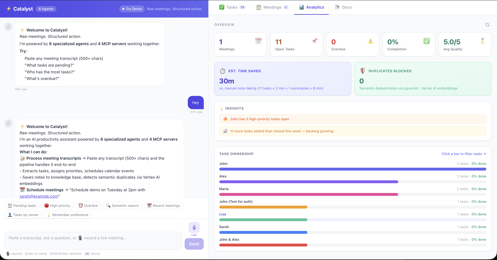

# ⚡ Catalyst — Raw meetings. Structured action.

> **Google Gen AI Academy APAC — Multi-Agent Systems with MCP Competition 2026**  
> Built by Mohit Singhal & Neha Lohia (Cold Start) · Google Cloud Run · Top 100 entry

**Catalyst turns any meeting transcript into structured action in under 10 seconds** — tasks extracted, priorities assigned, calendar events created, a Google Doc published, and the output self-graded by an AI judge. Paste a transcript, or just speak aloud.

🔗 **Live demo:** https://meetingmind-1046074361007.us-central1.run.app

## Dashboard


> *React dashboard — chat panel (left) · task board, analytics with charts, meeting history, Google Docs (right)*

## What makes this different

Most competition entries call one model once. Catalyst does five things that set it apart:

| # | Feature | What it means |
|---|---|---|
| 1 | **pgvector semantic dedup** | Before saving any task, cosine similarity check (threshold 0.85) against all existing tasks using Vertex AI embeddings. Duplicate meetings never double-count your backlog. |
| 2 | **LLM-as-Judge** | After every transcript, a separate `evaluation_agent` grades the pipeline output on 4 dimensions (1–5 scale). Score saved to DB. Shown as a scorecard in the UI. The AI evaluates itself. |
| 3 | **Parallel quota isolation** | `notes_agent` and `evaluation_agent` run simultaneously via `ParallelAgent`. They use **different Gemini model versions** (flash vs flash-lite) — separate Vertex AI quota pools — so they never rate-limit each other. |
| 4 | **Model fallback chain** | On any 429, the pipeline instantly retries: `gemini-2.5-flash` → `gemini-2.5-flash-lite` → `gemini-2.5-pro`. Zero crashes from quota exhaustion during the demo. |
| 5 | **Live voice input** | Speak a meeting aloud (Web Speech API). Catalyst processes the spoken transcript through the full 8-agent pipeline in real time. |

## Architecture

```
                        ┌─────────────────────────────────────────────────┐
  User (browser)        │              Google Cloud Run (port 8080)        │
  ─────────────         │                                                   │
  Chat panel    ──POST /api/chat──►  FastAPI  ──►  ADK Runner              │
  Task board    ──GET  /api/*  ──►  Direct DB       │                      │
  Analytics tab                      reads          │                      │
  Docs tab                                          ▼                      │
                                            ┌───────────────┐              │
                                            │  root_agent   │ Intent router│
                                            └──────┬────────┘              │
                                                   │                       │
               ┌───────────────┬──────────────────┬┴──────────────────┐   │
               │               │                  │                   │   │
               ▼               ▼                  ▼                   ▼   │
        TRANSCRIPT          QUESTION           COMMAND             MEMORY  │
            │               │                  │                   │      │
            ▼               ▼                  ▼                   ▼      │
   SequentialAgent      query_agent      execution_agent      store_memory│
   (3-stage pipeline)   pgvector RAG     mark/update/schedule   (inline)  │
        │                   │                  │                          │
        │              ─────┴──────────────────┴──────────                │
   Stage 1:            Cloud SQL (PostgreSQL + pgvector)                  │
   analysis_agent           │                                             │
   [flash]             Vertex AI text-embedding-004                       │
        │                                                                 │
   Stage 2:                                                               │
   save_and_schedule_agent                                                │
   [flash] + Google Calendar API                                          │
        │                                                                 │
   Stage 3: ParallelAgent ──────────────────────────────────────┐        │
        ├── notes_agent [gemini-2.5-flash]                       │        │
        │   save note + assemble briefing (~3s)                  │ 4 MCP  │
        └── evaluation_agent [gemini-2.5-flash-lite]             │ Servers│
            LLM-as-Judge: 4-dimension quality score (~5s)        │        │
                                                                 │        │
  MCP Servers ───────────────────────────────────────────────────┘        │
  ├── Tasks MCP      → PostgreSQL + pgvector                              │
  ├── Calendar MCP   → Google Calendar API                                │
  ├── Notes MCP      → PostgreSQL full-text                               │
  └── Workspace MCP  → Google Docs + Drive + Gmail                        │
                                                                          │
  React (Vite + Tailwind)  ◄── /static/* served from same container ──►  │
                                                                          │
                        └─────────────────────────────────────────────────┘
```

## 8 Agents — One responsibility each

| Agent | Responsibility | Model |
|---|---|---|
| `root_agent` | Intent router — classifies input, delegates to sub-agents | gemini-2.5-flash |
| `analysis_agent` | Summarise transcript, extract tasks with owners + deadlines, save meeting | gemini-2.5-flash |
| `save_and_schedule_agent` | Write tasks to PostgreSQL (with semantic dedup), create Calendar event | gemini-2.5-flash |
| `notes_agent` | Save meeting note, assemble final briefing via Python (zero extra LLM call) | gemini-2.5-flash |
| **`evaluation_agent`** | **LLM-as-Judge: grades own pipeline on 4 dimensions, saves score to DB** | **gemini-2.5-flash-lite** |
| `query_agent` | Semantic search, analytics, overdue tracking, proactive daily briefing | gemini-2.5-flash |
| `execution_agent` | Mark done, update status, schedule meetings (memory-aware) | gemini-2.5-flash |
| `transcript_pipeline` | SequentialAgent (stages 1→2) + ParallelAgent (stage 3) orchestrator | — |

## 4 MCP Servers

| Server | Tools | Integration |
|---|---|---|
| **Tasks MCP** | `save_tasks`, `update_task`, `check_duplicates` | PostgreSQL + pgvector |
| **Calendar MCP** | `create_calendar_event`, `get_available_slots` | Google Calendar API |
| **Notes MCP** | `save_note`, `search_notes`, `save_meeting_note` | PostgreSQL |
| **Workspace MCP** | `create_meeting_doc`, `search_gdrive`, `send_email` | Google Docs / Drive / Gmail |

## Technical deep-dives

### pgvector Semantic RAG
Every task, note, and meeting is embedded with **Vertex AI `text-embedding-004`** (768 dimensions) and stored in PostgreSQL with the **pgvector** extension.

- **IVFFlat indexes** on all 4 embedding columns for fast ANN search
- **Semantic deduplication** at save time — cosine similarity ≥ 0.85 blocks the duplicate and increments a `duplicates_blocked` counter visible in the Analytics dashboard
- **Semantic search** at query time — `"find tasks related to deployment"` returns meaning-based matches, not keyword matches

```sql
-- Semantic task search (simplified)
SELECT task_name, owner, 1 - (embedding <=> $1::vector) AS similarity
FROM tasks
WHERE status != 'Done' AND embedding IS NOT NULL
ORDER BY embedding <=> $1::vector
LIMIT 5;
```

### LLM-as-Judge (Self-Evaluating Pipeline)
`evaluation_agent` runs in parallel with `notes_agent` after every transcript. It grades the pipeline's own output:

| Dimension | What's measured |
|---|---|
| Summary Quality | Did it capture all decisions and outcomes? |
| Task Extraction | Were all action items found? |
| Priority Accuracy | Are High/Medium/Low correctly assigned? |
| Owner Attribution | Are tasks assigned to the right people? |

Score (1–5 per dimension, float overall) saved to `quality_scores` table. Shown as a popup scorecard in the UI. **The system gets smarter about its own weaknesses over time.**

### Parallel Quota Isolation
```
Stage 3 — ParallelAgent
├── notes_agent      [gemini-2.5-flash      → quota pool A]  ~3s
└── evaluation_agent [gemini-2.5-flash-lite → quota pool B]  ~5s
                      ↑ different model = different bucket = no collision
```
Both agents run concurrently. Using different model versions means they draw from separate Vertex AI quota pools — no 429 collision even under load.

### Model Fallback Chain
```python
FALLBACK_MODELS = ["gemini-2.5-flash", "gemini-2.5-flash-lite", "gemini-2.5-pro"]

# On 429 → instantly retry with next model (no timeout wait)
for model in FALLBACK_MODELS:
    try:
        result = await runner.run_async(model=model, ...)
        break
    except ResourceExhausted:
        continue  # next model
```
429s from Vertex AI throw immediately — the fallback adds ~100ms, not seconds.

### Global Memory Persistence
Preferences are stored under a fixed `global_user_preferences` session key — **not** tied to a browser tab or UUID. Memory survives refresh, new sessions, even different devices.

```
"Remember our team prefers morning meetings"
→ Stored globally, injected into execution_agent at request time
→ "Schedule demo with Sarah on Friday sarah@example.com"
→ Scheduled at 09:00 automatically. No clarifying question asked.
```

### 33% Fewer LLM Calls
| Before | After | Saving |
|---|---|---|
| 6 LLM calls per transcript | 5 LLM calls | –1 call |
| `briefing_agent` (LLM) | Python tool `assemble_briefing_from_state()` | Eliminated |
| `memory_store_agent` (sub-agent) | Inline `store_memory_direct()` tool call | Eliminated |

## Database schema

```sql
meetings      (id UUID PK, transcript TEXT, summary TEXT, embedding vector(768),
               doc_url TEXT, duplicates_blocked INT, session_id, created_at)

tasks         (id UUID PK, meeting_id UUID FK, task_name TEXT, owner TEXT,
               deadline TEXT, priority TEXT, status TEXT, embedding vector(768), created_at)

notes         (id UUID PK, meeting_id UUID FK, title TEXT, content TEXT,
               embedding vector(768), created_at)

memory        (id UUID PK, session_id TEXT, key TEXT, value TEXT,
               embedding vector(768), created_at)  -- UNIQUE(session_id, key)

quality_scores(id UUID PK, meeting_id UUID FK, summary_quality INT,
               task_extraction_completeness INT, priority_accuracy INT,
               owner_attribution INT, overall_score FLOAT,
               flags JSONB, recommendations JSONB, created_at)
```

**Indexes:** IVFFlat (cosine) on all 4 embedding columns · B-tree on `status`, `owner`, `priority`, `session_id`

## React Dashboard

One Cloud Run URL serves both FastAPI and React — no CORS, no separate deployments.

| Tab | What it shows |
|---|---|
| **Tasks** | All extracted tasks · filter by status/owner/priority · inline status edit · deadline picker · bulk actions · CSV export |
| **Meetings** | Timeline of processed meetings · expandable task list · progress bar · copy summary |
| **Analytics** | SVG charts (ownership bars, weekly trend line) · smart insights · overdue list with inline Mark Done · time saved · duplicates blocked |
| **Docs** | Every transcript auto-publishes a Google Doc — click to open |

**UI features:** Live pipeline visualizer · Quality scorecard popup · Voice input (Web Speech API, Chrome/Edge) · Proactive daily briefing ("what needs my attention?") · Overdue alert banner · Model fallback indicators · Real-time tab badges

## Demo flow (5 minutes)

```
0:00 – 0:30  Problem: "Teams waste $37B/yr on unactionable meetings"
0:30 – 2:00  Paste Q3 Planning transcript → watch 3-stage pipeline animate
             → Briefing card: summary, tasks, calendar link, est. meeting cost
2:00 – 3:00  Dashboard: charts, quality scorecard (4.2/5), overdue banner
3:00 – 3:45  Ask "What needs my attention?" → proactive briefing in 3s
3:45 – 4:15  "Create a doc for this meeting" → Google Doc URL, click it live
4:15 – 5:00  Architecture: 8 agents, 2 parallel stages, pgvector RAG,
             LLM-as-Judge, 4 MCP servers, model fallback, voice input
```

**Backup:** If live demo fails, pre-processed session at the demo URL has full data already loaded.

## Deployment

```bash
# Build + deploy to Cloud Run
gcloud builds submit --tag gcr.io/$PROJECT_ID/catalyst .
gcloud run deploy catalyst \
  --image gcr.io/$PROJECT_ID/catalyst \
  --platform managed \
  --region asia-southeast1 \
  --allow-unauthenticated \
  --set-env-vars PROJECT_ID=...,DB_HOST=...,CALENDAR_ID=...
```

**Stack:** Python 3.11 · FastAPI · Google ADK · PostgreSQL + pgvector · Vertex AI Embeddings · Gemini 2.5 Flash/Flash-Lite/Pro · React 18 + Vite + Tailwind · Docker multi-stage · Cloud Run

## Project structure

```
catalyst/
├── agent.py                  # 8 agents — all ADK definitions
├── server.py                 # FastAPI + ADK runner + model fallback
├── tools/
│   ├── db_tools.py          # PostgreSQL + pgvector CRUD + semantic search
│   ├── embeddings.py        # Vertex AI text-embedding-004 wrapper
│   ├── analytics_tools.py   # Ownership, trends, velocity, quality, overdue
│   ├── workspace_tools.py   # Google Docs / Drive / Gmail
│   ├── calendar_tools.py    # Google Calendar event creation
│   └── notes_tools.py       # Meeting notes + Python briefing assembly
├── frontend/src/App.jsx      # Entire React dashboard (~2100 lines)
├── schema.sql                # PostgreSQL + pgvector schema + seed data
├── Dockerfile                # Multi-stage: Node 20 build → Python 3.11 serve
├── DEMO_SCRIPT.md            # Timed 5-minute demo script
└── SAMPLE_TRANSCRIPT.md      # 4 realistic test transcripts
```

## Quick start (local)

```bash
git clone <repo> && cd catalyst
cp .env.example .env          # fill in GCP project, DB, Calendar ID

pip install -r requirements.txt
python -c "from tools.db_tools import init_db; init_db()"  # run schema.sql

cd frontend && npm install && npm run build && cd ..
uvicorn meetingmind.server:app --port 8080
# open http://localhost:8080
```

| Env var | Description |
|---|---|
| `PROJECT_ID` | GCP project ID |
| `DB_HOST` / `DB_NAME` / `DB_USER` / `DB_PASS` | Cloud SQL connection |
| `CALENDAR_ID` | Google Calendar ID for event creation |
| `MODEL` | Primary model (default: `gemini-2.5-flash`) |
| `EVAL_MODEL` | Evaluation agent model (default: `gemini-2.5-flash-lite`) |

## Tests

```bash
pytest tests/ -v   # 15 tests
```

Covers: semantic deduplication · embedding batch calls · date parsing · task filtering · meeting save/load · analytics queries · MCP server responses

*Built for Google Gen AI Academy APAC — Multi-Agent Systems with MCP Competition 2026*  
*Mohit Singhal & Neha Lohia — Cold Start team*
